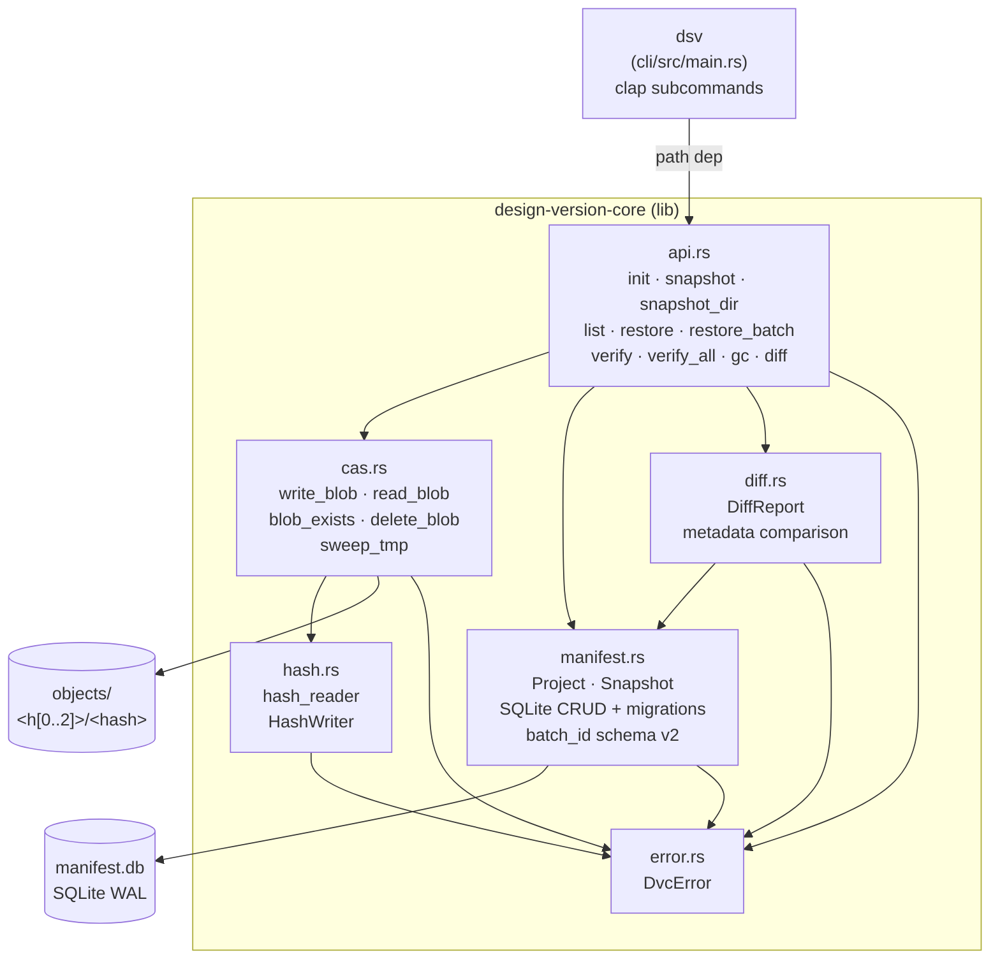

# UML — design-version-client

_Last updated: 2026-05-13 — User documentation created: comprehensive non-coder guide with real-world workflows, troubleshooting, and safety notes_

## Overview

`design-version-client` is a local, library-first snapshot store for large designer binary files (`.psd`, `.psb`, `.3dm`, `.pdf`, `.png`, `.jpg`). It is a Rust workspace with two crates: a `core` library that owns all logic, and a thin `cli` binary used for manual testing. Storage uses a full-file content-addressable store (BLAKE3 blobs + SQLite manifest). No network, no daemon.

## Module map

- `core/src/api.rs` — public entry points: `init`, `snapshot`, `snapshot_dir`, `list`, `restore`, `restore_batch`, `verify`, `verify_all`, `gc`, `diff`, `total_logical_bytes`
- `core/src/cas.rs` — content-addressable object store: atomic blob write/read/delete, sweep_tmp
- `core/src/hash.rs` — BLAKE3 streaming hasher, `HashWriter<W>` (tee-style single-pass hash+write)
- `core/src/manifest.rs` — SQLite schema v2 (batch_id column) + CRUD for `projects` and `snapshots` tables, migration system
- `core/src/diff.rs` — snapshot metadata comparison: `DiffReport` struct with size deltas and content matching
- `core/src/error.rs` — `DvcError` enum (`Io`, `HashMismatch`, `Manifest`, `NotFound`, `InvalidArgument`)
- `cli/src/main.rs` — clap CLI: `dsv init/snapshot/list/restore/verify/gc/label/diff` with filtering and batch operations
- `core/tests/integration.rs` — integration + proptest suite; 800 MB test gated behind `RUN_LARGE_FILE_TESTS=1`

## Class / component diagram

## Key data flows

- **snapshot:** `api::snapshot` → opens file → `cas::write_blob` (single-pass BLAKE3 + atomic tmp→rename) → `manifest::insert_snapshot`
- **snapshot_dir:** `api::snapshot_dir` → `walkdir` directory walk → batch all files under shared `batch_id` (UUID) → SQLite transaction rollback on partial failure
- **restore:** `api::restore` → `manifest::get_snapshot` → `cas::read_blob` → verify hash → stream blob to `out_path`
- **restore_batch:** `api::restore_batch` → `manifest::list_snapshots_by_batch` → restore all files preserving relative paths
- **gc:** `api::gc` → dry-run by default (count + bytes) → `--confirm` flag for actual deletion → `manifest::referenced_hashes` → `cas::delete_blob`
- **verify:** `api::verify` → single snapshot or `verify_all` for all blobs → hash verification + missing/corrupt reporting
- **diff:** `api::diff` → pure metadata comparison → size deltas (bytes + percentage) + content match indicator

## Last activity

- `2026-05-13` — **User documentation created:** Comprehensive non-coder guide covering basic concepts, real-world workflows, troubleshooting, and safety. Files touched: `docs/USER-GUIDE.md`, `README.md`, `UML.md`
- `2026-05-13` — **Milestone 2 validated:** Comprehensive beta testing across 15 designer scenarios, fixed CLI batch argument parsing bugs (restore/label), corrected filtered list totals. All core workflows verified: project evolution, disaster recovery, team handoff, storage integrity. Ready for UI development.
- `2026-05-13` — **Milestone 2 complete:** Multi-file directory snapshots (batch_id schema v2), label workflows, GC/verify improvements, diff command, cross-platform CI. Added `walkdir` dependency, `core/src/diff.rs` module. All 53 tests passing (34 unit + 19 integration + 1 gated 800MB benchmark)
- `2026-05-13` — Renamed binary dvc → dsv (default store .dsv); removed CONTEXT.md + plan.md from repo. Files touched: `cli/Cargo.toml`, `cli/src/main.rs`, `README.md`, `.gitignore`, `docs/adr/0001-storage-layout.md`, `UML.md`, `UML.html`
- `2026-05-13` — Milestone 1 complete: Cargo workspace, all core modules, CLI, 25 tests. Files touched: `Cargo.toml`, `core/**`, `cli/src/main.rs`, `core/tests/integration.rs`, `README.md`, `CONTEXT.md`, `docs/adr/0001-storage-layout.md`
- `2026-05-13` — Project bootstrapped: scaffold, `CONTEXT.md`, `ADR-0001`, `UML.md` created
