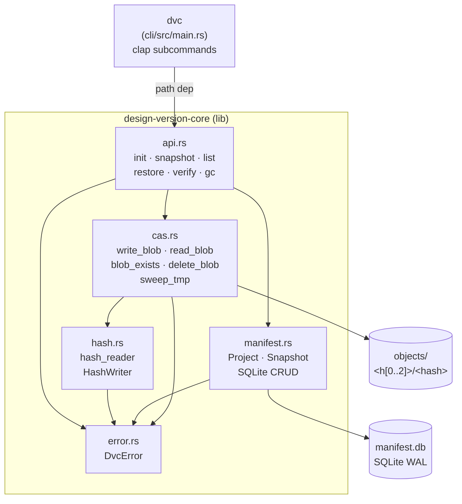

# UML — design-version-client

_Last updated: 2026-05-13 — Milestone 1 implemented; all 25 tests green_

## Overview

`design-version-client` is a local, library-first snapshot store for large designer binary files (`.psd`, `.psb`, `.3dm`, `.pdf`, `.png`, `.jpg`). It is a Rust workspace with two crates: a `core` library that owns all logic, and a thin `cli` binary used for manual testing. Storage uses a full-file content-addressable store (BLAKE3 blobs + SQLite manifest). No network, no daemon.

## Module map

- `core/src/api.rs` — public entry points: `init`, `snapshot`, `list`, `restore`, `verify`, `gc`
- `core/src/cas.rs` — content-addressable object store: atomic blob write/read/delete, sweep_tmp
- `core/src/hash.rs` — BLAKE3 streaming hasher, `HashWriter<W>` (tee-style single-pass hash+write)
- `core/src/manifest.rs` — SQLite schema + CRUD for `projects` and `snapshots` tables
- `core/src/error.rs` — `DvcError` enum (`Io`, `HashMismatch`, `Manifest`, `NotFound`, `InvalidArgument`)
- `cli/src/main.rs` — clap CLI: `dvc init/snapshot/list/restore/verify/gc`
- `core/tests/integration.rs` — integration + proptest suite; 800 MB test gated behind `RUN_LARGE_FILE_TESTS=1`

## Class / component diagram

## Key data flows

- **snapshot:** `api::snapshot` → opens file → `cas::write_blob` (single-pass BLAKE3 + atomic tmp→rename) → `manifest::insert_snapshot`
- **restore:** `api::restore` → `manifest::get_snapshot` → `cas::read_blob` → verify hash → stream blob to `out_path`
- **gc:** `api::gc` → `manifest::referenced_hashes` → walk `objects/` → `cas::delete_blob` for any unreferenced hash
- **verify:** `api::verify` → `manifest::get_snapshot` → `hash::hash_reader(blob)` → compare against stored hash

## Last activity

- `2026-05-13` — Milestone 1 complete: Cargo workspace, all core modules, CLI, 25 tests. Files touched: `Cargo.toml`, `core/**`, `cli/src/main.rs`, `core/tests/integration.rs`, `README.md`, `CONTEXT.md`, `docs/adr/0001-storage-layout.md`
- `2026-05-13` — Project bootstrapped: scaffold, `CONTEXT.md`, `ADR-0001`, `UML.md` created
